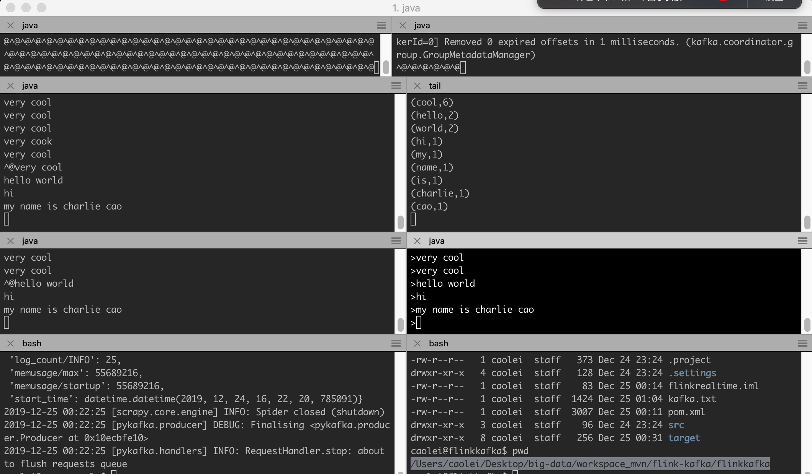

# flink-kafka-prototype


# kafka setup

下载
```
cd /Users/caolei/Desktop/big-data

wget http://mirror.cogentco.com/pub/apache/kafka/2.4.0/kafka_2.12-2.4.0.tgz
```

解压
```
tar -zxvf kafka_2.12-2.4.0.tgz
```

启动zookeeper
```
cd /Users/caolei/Desktop/big-data/kafka_2.12-2.4.0

bin/zookeeper-server-start.sh config/zookeeper.properties
```

启动kafka
```
bin/kafka-server-start.sh config/server.properties
```

创建Topic
```
bin/kafka-topics.sh --create --bootstrap-server localhost:9092 --replication-factor 1 --partitions 1 --topic test
```
查看Topic
```
bin/kafka-topics.sh --list --bootstrap-server localhost:9092
```
测试发送数据
```
bin/kafka-console-producer.sh --broker-list localhost:9092 --topic test
```
测试接受数据
```
bin/kafka-console-consumer.sh --bootstrap-server localhost:9092 --topic test --from-beginning
```

# flink setup

```
cd /Users/caolei/Desktop/big-data/flink-1.9.1

./bin/start-cluster.sh
```

# build 

cd /Users/caolei/Desktop/big-data/workspace/flink/flink-kafka-prototype

mvn clean package

# run

submit to http://localhost:8081/

# test
```
bin/kafka-console-producer.sh --broker-list localhost:9092 --topic test

tail -f /Users/caolei/Desktop/big-data/workspace_mvn/flink-kafka/flinkkafka/kafka.txt
```

# 命令行提交,注意需要删除之前生成的文件.
```
/Users/caolei/Desktop/big-data/flink-1.9.1/bin/flink run -c FlinkKafka.KafkaDemo target/flink-realtime-1.0-SNAPSHOT-jar-with-dependencies.jar
/Users/caolei/Desktop/big-data/flink-1.9.1/bin/flink run -d -c FlinkKafka.KafkaDemo target/flink-realtime-1.0-SNAPSHOT-jar-with-dependencies.jar
```
---

终于把整个流运算流程走通了.好费劲啊.

scrapy -> kafka -> flink -> hdfs.

flink 打包直接用mvn. 然后在页面上提交到任务
http://localhost:8081/

开启多个窗口,就可以看到不同的topic中传输过来的数据在flink里的一个窗口期中运算完毕并保存到本地文件中.


关键源码参考了这位的.
https://github.com/mabdulrazzak/flink-kafka-prototype/tree/master/src/main/java

我发先java的包管理好用是好用,但是导致系统变得异常复杂.版本依赖.再加上IDE,死的更惨.

所以还是离开这些东西,从头开始整,才能搞清楚.

先熟悉一下,下一步是基础架构 ETL 数据仓库 血缘关系.

还是在github上直接看源码来的更直接有效. 看别人的教程实在是太绕弯了.


----

scrapy kafka flink(ETL) kafka mysql

汇总
人工智能推荐
----
最小模型.
启动3个项目

#1 实验1
1 定时每日采集新浪新闻
2 发送kafka管道
3 清洗 记录分类
4 发送kafka管道
5 把结果放入mysql

#2 实验2
在实验一基础上增加用户画像功能

#2 实验3
在实验2基础上增加人工智能推荐功能.

#2 实验4
在实验3基础上增加静态内容生成功能.

#3 实验5
在实验4基础上增加指标分析和BI功能.

最终这是个今日头条的基础架构.

在加上互动推广的系统.

配合精益创业的思维.可以成为一个新的行业纵深内容聚合平台么??

也许可以做网络原创内容的推广.和订阅.